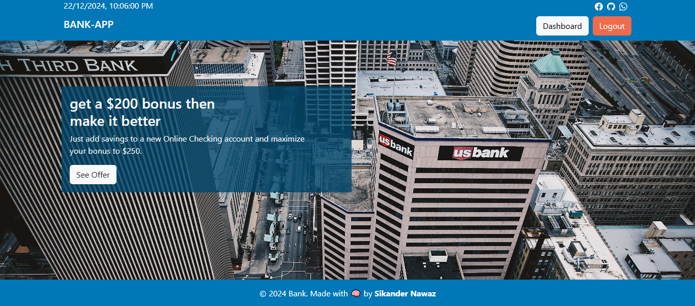
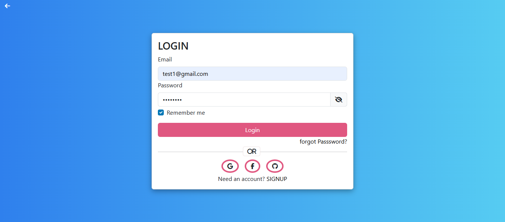
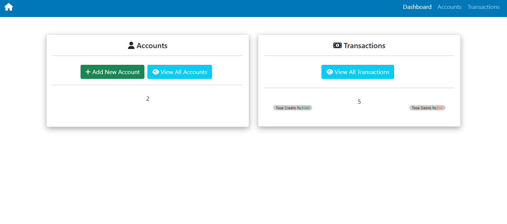
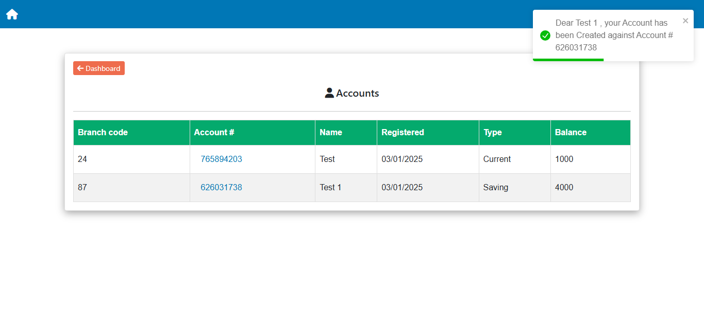
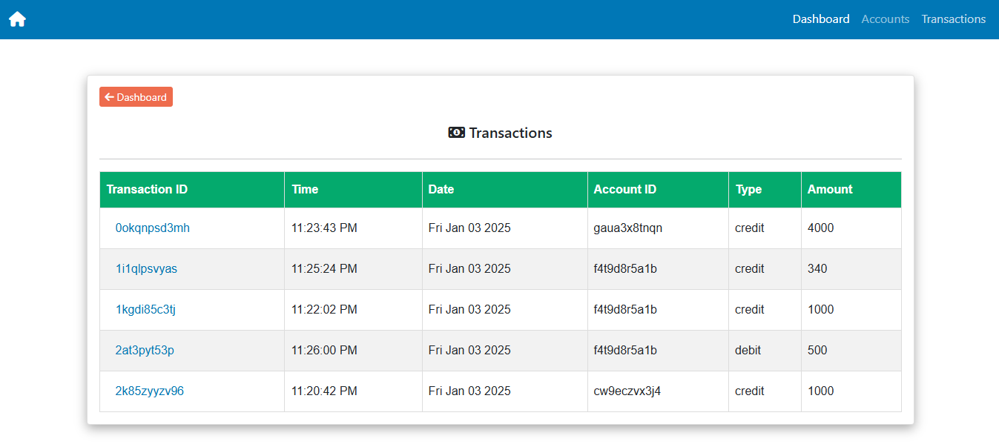

<p align="center">
  <h1 align="center">Bank Application</h1>
</p>

**The Bank-App is a full-stack web application** built with **React JS** and **Firebase**, which aims to provide users with a secure and convenient way to manage their banking needs
<br />

 <br /> <br />

The application includes a range of functionalities, such as:

- Authentication with email and password, as well as login via social media accounts like Google, Facebook, and Github.

- Once authenticated, users are taken to the dashboard, which is the central hub for all banking activities. The dashboard provides users with access to an ATM machine-like interface, where they can perform basic banking transactions such as withdrawing and depositing money.

- Users can easily withdraw or deposit money from their accounts using the intuitive interface, which guides them through the process step-by-step. Additionally, they can also view their transaction history, which displays all past transactions with details such as date, amount, and account balance.

- The Bank-App also allows users to delete their account, in case they no longer wish to use the platform.
- The application provides users with the ability to view all their existing accounts, providing a complete overview of their financial situation.

## How to run ?

#### Run First

```javascript
npm i
```

#### Run Second

```javascript
npm start
```

### 1- Landing Page

 <br />

### 2- Login Page

 <br />

### 3- Dashboard

 <br />

### 4- Create Account

 <br />

### 5- Accounts

 <br />

### 6- Account Detail

 <br />

### 7- Delete Account

 <br />

### 8- Deposit Amount

 <br />

### 9- Withdraw Amount

 <br />

### 10- Transactions

 <br />

### 11- View Transaction

 <br /> <br />
